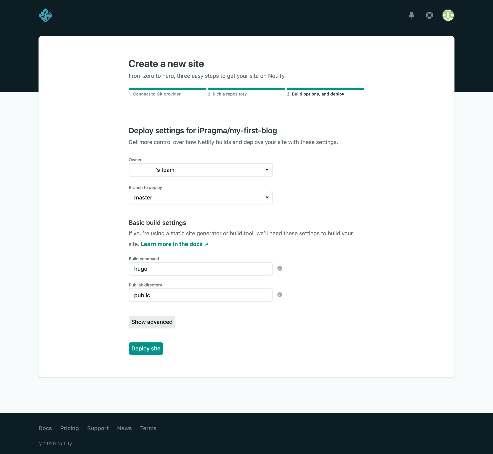

**Hugo** est un formidable outil pour créer un site en quelques minutes et il existe de nombreuses solutions gratuites pour héberger le site, telles que Github, Gitlab, Netlify...

Ce tutoriel présente la solution que j'ai choisie pour mon blog, à savoir un repository **Github** dans lequel je sauvegarde le code source du site et **Netlify** pour héberger et déployer mon site **Hugo** à chaque mise à jour. 

## Prérequis

Les outils suivants sont nécessaires pour ce tutoriel :

- Git installé → *version utilisée : 2.20.1*
- Hugo installé → *version utilisée : 0.62.1*
- un compte Github 
- un compte Netlify (il est possible de se connecter avec son compte Github)

Si certains de ces outils sont manquants sur votre machine, une petite recherche sous Google vous permettra de trouver la procédure à suivre pour les installer.

---

## Étape 1. Créer un site avec Hugo

### Créer un projet Hugo

Créer un nouveau projet Hugo dans le répertoire `my-first-blog`

    hugo new site my-first-blog
    cd my-first-blog

### Choisir un thème

Télécharger un thème et l'ajouter au sous-répertoire du site `themes` 

Pour cet example, j'utilise le thème [Minimal](https://themes.gohugo.io/minimal/). 

    # initialise Git
    git init

    # add theme via submodule
    git submodule add https://github.com/calintat/minimal.git themes/minimal

Pour obtenir un site avec un peu de contenu rapidement, recopier le répertoire `exampleSite` dans la racine du site. 

    cp -r themes/minimal/exampleSite/* ./

Dans le fichier de configuration `config.toml`, modifier la ligne suivante comme indiqué

    baseURL = "/"

### Tester le site en local

Enfin, démarrer le serveur inclus avec Hugo pour avoir un aperçu du site créé

    hugo server 

Par défaut, le nouveau site est accessible avec l'URL [http://localhost:1313](http://localhost:1313).



Si vous désirez juste avoir un aperçu du thème sans modifier le répertoire racine du site, mais en utilisant le contenu fourni en exemple, exécuter la commande suivante

    cd themes/minimal/exampleSite
    hugo server --themesDir ../..





La commande `hugo server` peut être utilisée avec d'autres options.

    # include content marked as draft 
    hugo server -D

    # enable full re-renders on changes
    hugo server --disableFastRender



---

## Étape 2. Créer un repository Github

### Créer un repository Github

Dans votre compte Github, créer un nouveau repository `my-first-blog`.

### Ajouter le site au repository local

    # add the files in the local repository
    git add .

    # commit the tracked changes
    git commit -m "first commit"

### Push le site dans Github

    # set the new remote repository
    git remote add origin https://github.com/[YOUR-GITHUB-ACCOUNT]/my-first-blog.git

    # push the changes in your local repository up to the remote repository
    git push -u origin master

---

## Étape 3. Déployer sur Netlify

### Connecter Netlify à votre hébergeur Git

Dans votre compte Netlify, créer un nouveau site en cliquant sur `New site from Git`.

Sélectionner `Github`

### Créer un nouveau site à partir de Github

Après avoir donné l'accès à Netlify, choisir le repo `my-first-blog`.

### Déployer le site

Cliquer sur `Deploy site` et après quelques instants, Netlify fournit une URL pour accéder au site online.

Votre site est déployé !

---

**Références :**

- https://www.rockyourcode.com/move-to-hugo-with-netlify/
- https://gohugo.io/getting-started/quick-start/
- https://www.freecodecamp.org/news/your-first-hugo-blog-a-practical-guide/
- https://tsh.io/blog/static-site-deployment-with-netlify/
- https://gohugo.io/hosting-and-deployment/hosting-on-netlify
  