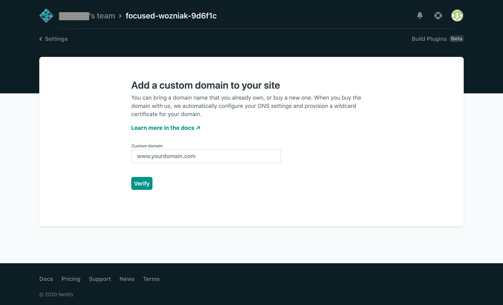
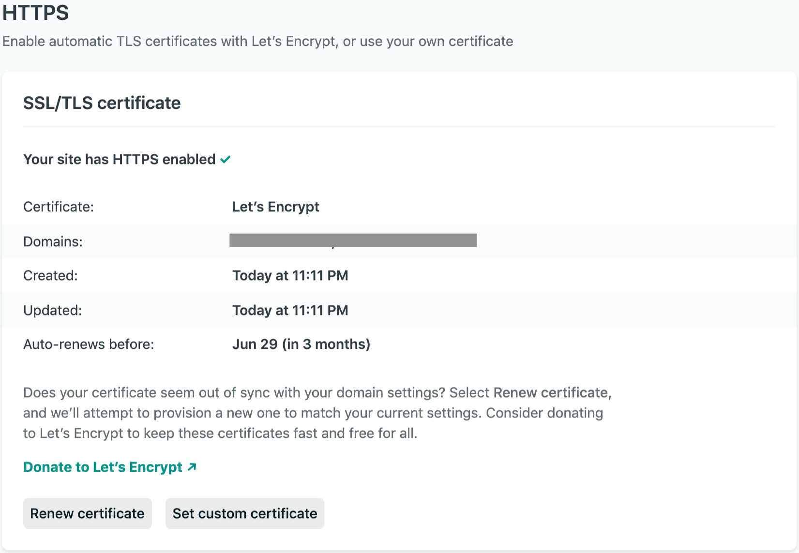

Dans un post précédent, je montrais comment créer un site Hugo et le déployer avec Netlify. Pour avoir un site complet, il faut également connecter le site hébergé par Netlify à un nom de domaine.

Si vous achetez votre nom de domaine avec Netlify, la configuration est automatique. Si, comme moi, vous faites appel au service de Namecheap pour acheter vos noms de domaine, il existe 2 méthodes pour configurer votre nom de domaine. Vous avez le choix d'utiliser les serveurs DNS de Namecheap, ou ceux de Netlify.

Dans ce post, j'expose la 1ère méthode en utilisant les serveurs DNS de Namecheap.

## Configurer Namecheap

Dans le tableau de bord de Namecheap, cliquer sur le bouton `MANAGE` 

Ensuite aller dans `Advanced DNS`

Par défaut, 2 lignes sont créer pour renvoyer votre nom de domaine vers une parking page.

Dans la section `DNS TEMPLATE`, il n'existe pas de template pour Netlify, utiliser le template pour **Shopify** et valider

Il permet de générer 2 lignes

* A Record, changer la valeur par l'IP du serveur Netlify `104.198.14.52` 
* CNAME Record pour le Host `www`, changer la valeur par l'adresse du sous-domaine Netlify de votre site

Sauvegarder tous les changements en cliquant sur le bouton `SAVE ALL CHANGES`

La propagation de la configuration DNS prend un peu de temps, généralement ça se produit dans l'heure. Il est possible de vérifier l'avancée de la propagation sur un site comme [whatsmydns.net](https://www.whatsmydns.net/).

## Configurer netlify

Dans la configuration du site Hugo créé, afficher les informations sur votre domaine

Cliquer sur le bouton `Add custom domain`

Remplir le nom de votre domaine obtenu avec Namecheap 

Valider en cliquant sur `Yes, add domain`

Afficher les informations HTTPS en bas de la page de configuration du domaine 

Netlify peut obtenir un certificat SSL gratuitement auprès de **Let's Encrypt**. Cliquer sur `Verify DNS configuration`pour lancer la vérification de la configuration faite sur Namecheap

Une fois la vérification DNS validée, rafraîchir la page pour afficher les informations sur votre nouveau certificat SSL

