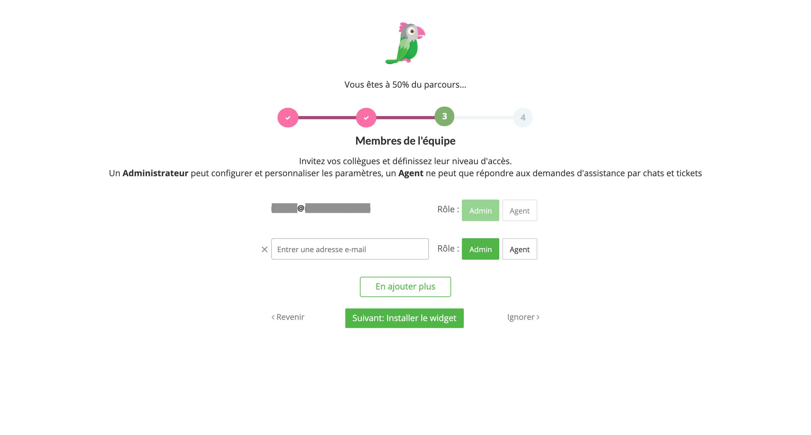

Pour ce tutoriel, je vais utiliser [Tawk.to](https://www.tawk.to/) pour installer un widget de live chat sur un site Hugo.

Cependant, il est possible d'utiliser la même méthode, pour installer ce widget sur n'importe quel générateur de site statique tel que **Jekyll**, **Gatsby**, **Hexo**...

[Tawk.to](https://www.tawk.to/) est une application gratuite de live chat pour sites web. Il est simple à installer et à utiliser.

Il existe d'autres solutions gratuites 

* [My Live Chat](https://mylivechat.com/)
* [LiveSupporti](https://livesupporti.com/)
* [Userlike](https://www.userlike.com/)
* [Smartsupp](https://www.smartsupp.com/)
* [LiveAgent](https://www.liveagent.com/)
* [Zendesk](https://www.zoho.com/desk/live-chat-ticketing-software.html)
* [Pure Chat](https://purechat.com/)

## Prérequis

Les outils suivants sont nécessaires pour ce tutoriel :

- un site Hugo  
- un compte [Tawk.to](https://www.tawk.to/)

## Générer le code du widget Tawk.to

Avant de pouvoir installer le live chat sur un site Hugo, générer le code à installer en exécutant les 4 étapes suivantes

Sur le dernier écran, le code généré peut maintenant être installé sur votre site Hugo.

Comme il est suggéré, il faut copier le code généré avant la balise `</body>`. Je vais reprendre l'exemple du site créé dans un [tutoriel précédent](posts/2020-01-05-create-a-website-with-hugo-and-deploy-to-netlify/) avec le thème **Minimal**.

Créer un fichier `body-close.html` dans le répertoire `/layouts/partials`et copier le code généré dans ce fichier 

    <!--Start of Tawk.to Script-->
    
    <!--End of Tawk.to Script-->

## Installer le widget sur un site

Une fois configuré, le widget [Tawk.to](https://www.tawk.to/) apparaît en bas de chaque page du site.

les visteurs de votre site peuvent maintenant communiquer directement avec vous en vous connectant au tableau de bord de [Tawk.to](https://www.tawk.to/)

---

**Références :**

- https://blog.simplestrat.com/5-simple-ways-to-add-live-chat-to-website-free
- https://www.romainvincent.com/pourquoi-je-suis-passe-de-zopim-a-tawk-to-pour-mon-tchat/
- https://www.zendesk.com/apps/support/hugo/
- https://elfsight.com/whatsapp-chat-widget/html/
- https://mobilemonkey.com/blog/add-live-chat-to-website

  